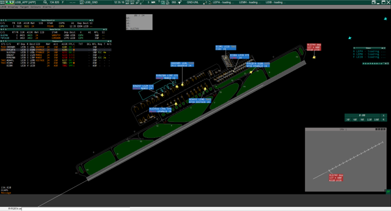
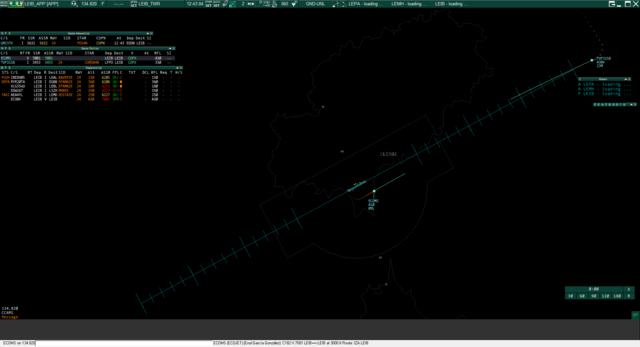
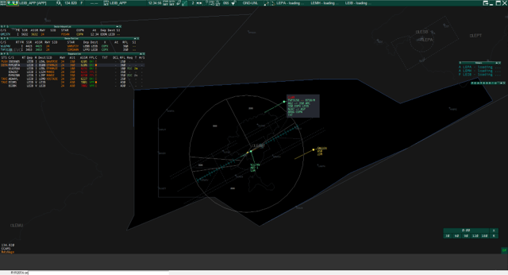

# MyEuroscopeSettings
En este repositorio estare subiendo y manteniendo la configuración que yo utilizo para el software Euroscope, cualquier persona que lo desee la puede utilizar y modificar a su gusto. Los archivos subidos incluyen:
- Ficheros ASR modificados por mí, excluyendo aquellos que provee VatSpa y que no he modificado
- Ficheros PRF simplificados. En mi equipo no empleo la configuración subida, pero es una forma sencilla para poder realizar la instalación y actualización de forma manual para gente que no dispone de amplios conocimientos de informática.
- Ficheros Settings. El directorio LEXX/Settings contiene la configuración para que se visualice todo tal cual lo tengo yo. Las opciones de visualización están creadas a partir de la unión entre los ficheros de configuración publicados por VatSpa y por Vatsim UK.
- Configuración de plugins. La carpeta LEXX/Plugins también contiene una configuración para que el plugin VFPC funcione. Este solo funciona con los aeropuertos en los que esté configurado.

A continuación incluyo 3 capturas de cómo se vería LEIB con mi configuración.

## Plugins
Ademas de los ficheros de configuración que incluyo en el repositorio, tengo instalados los siguientes plugins:
- [RDF Plugin for Euroscope](https://github.com/chembergj/RDF)
- [vSMR](https://github.com/pierr3/vSMR)
- Ground Radar Plugin (incluido con los sectores)
- [VCH](https://github.com/DrFreas/VCH)
- [CCAMS](https://github.com/kusterjs/CCAMS)
- [VFPC](https://github.com/hpeter2/VFPC)
- [Discord Euroscope](https://github.com/Kirollos/DiscordEuroscope)
- [UK Controller Plugin](https://community.vatsim.uk/files/downloads/file/215-uk-controller-plugin/)

## Actualización de sectores
Empleando los ficheros PRF que tengo en este repositorio la actualización de sectores se puede hacer manualmente. Los nuevos sectores se descargan desde [esta web](http://files.aero-nav.com/LEXX), la carpeta descargada se descomprime en la carpeta "Documentos/Euroscope" reemplazando los archivos que se pidan. Dentro de los archivos descargados hay dos que tienen un nombre similar a "GCCC-GCCC_20210520191820-210501-0001", que contienen la información del sector descargada. Para que funcionen los ficheros PRF de este repositorio hay que cambiar el nombre de esos dos archivos de tipo SCT y ESE por "GCCC", "LECB" y "LECM" en función del FIR al que corresponda. En caso de ya tener unos sectores antiguos con ese nombre se eliminan los antiguos y se colocan los nuevos que tengan ese nombre.
